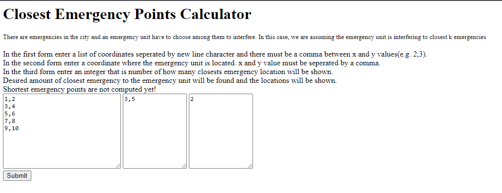

# BIL-481_hw1

The website is reachable via: (https://hidden-dawn-89179.herokuapp.com/)

There can be many emergencies in any point at the city. An emergency unit must decide what emergencies to interfere. In this case it's assumed that an emergency unit will interfere to closest emergency. In order to make it easier, locations of emergencies will insert in the first form, and the location of the emergency unit will insert in the second form. The app will calculate distances to the emergency unit and find desired amount of closest emergency will be shown as output in ascending order.  

Input entry must match with format:
